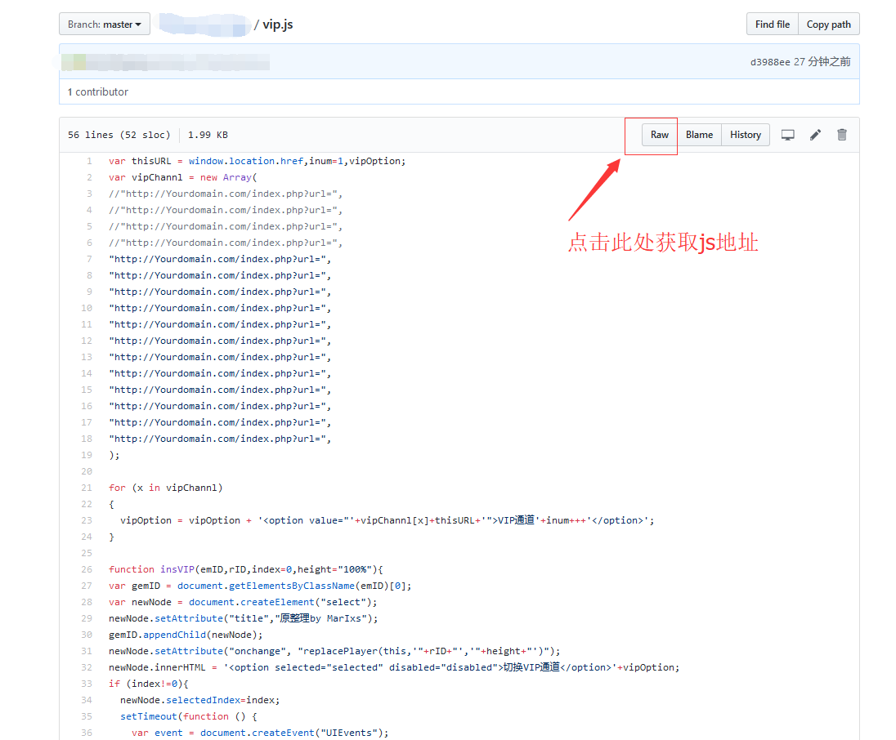

# 使用github恢复koolproxy VIP接口
> 以前存了一份 @MarIxs 的vip.js，本以为用不上的，结果近来发现这个规则已经失效了，试了一下发现只用替换一下原来的接口就能继续用了，想了想决定把方法分享出来，仅供参考

## 一、准备github账号，并创建仓库
网上教程会很多，不多赘述
给出两个教程贴：
http://blog.csdn.net/zhaozhiwen6140/article/details/50777920
https://jingyan.baidu.com/article/8cdccae9269b1f315413cde2.html

## 二、 创建一个vip.js文件，并将以下代码拷贝进去
1.在仓库中创建脚本文件

2.复制代码

3.完成


```javascript
var thisURL = window.location.href,inum=1,vipOption;
var vipChannl = new Array(
"http://Yourdomain.com/index.php?url=",
"http://Yourdomain.com/index.php?url=",
"http://Yourdomain.com/index.php?url=",
"http://Yourdomain.com/index.php?url=",
"http://Yourdomain.com/index.php?url=",
"http://Yourdomain.com/index.php?url=",
"http://Yourdomain.com/index.php?url=",
"http://Yourdomain.com/index.php?url=",
"http://Yourdomain.com/index.php?url=",
"http://Yourdomain.com/index.php?url=",
"http://Yourdomain.com/index.php?url=",
"http://Yourdomain.com/index.php?url=",
"http://Yourdomain.com/index.php?url=",
"http://Yourdomain.com/index.php?url=",
"http://Yourdomain.com/index.php?url=",
"http://Yourdomain.com/index.php?url=",
);

for (x in vipChannl)
{
  vipOption = vipOption + '<option value="'+vipChannl[x]+thisURL+'">VIP通道'+inum+++'</option>';
}

function insVIP(emID,rID,index=0,height="100%"){
var gemID = document.getElementsByClassName(emID)[0];
var newNode = document.createElement("select");
newNode.setAttribute("title","整理by MarIxs");
gemID.appendChild(newNode);
newNode.setAttribute("onchange", "replacePlayer(this,'"+rID+"','"+height+"')");
newNode.innerHTML = '<option selected="selected" disabled="disabled">切换VIP通道</option>'+vipOption;
if (index!=0){
  newNode.selectedIndex=index;
  setTimeout(function () {
    var event = document.createEvent("UIEvents");
    event.initUIEvent("change", true, true);      
    newNode.dispatchEvent(event);
  }, 1000);
}
}

function replacePlayer(e,rID,height="100%"){
    var playerID = document.getElementById(rID);
    playerID.innerHTML = '';
    var newplayerID = document.createElement("iframe");
    playerID.appendChild(newplayerID);
    newplayerID.setAttribute("border","0");
    newplayerID.setAttribute("frameborder","no");
    newplayerID.setAttribute("scrolling","no");
    newplayerID.setAttribute("marginwidth","0");
    newplayerID.setAttribute("width","100%");
    newplayerID.setAttribute("height",height);
    newplayerID.src = e.value;
}
```

由于可能涉及到侵权，请自行寻找接口！请自行寻找接口！
Please reverse the blank space below！

```javascript
//接口示例
"http://example.example.com/index.php?url=",
"http://example.example.com/index.php?url=",
"http://example.example.com/index.php?url=",
"http://example.example.com/index.php?url=",
"http://example.example.com/index.php?url=",
"http://example.example.com/index.php?url=",
"http://example.example.com/index.php?url=",
"http://example.example.com/index.php?url=",
"http://example.example.com/index.php?url=",
"http://example.example.com/index.php?url=",
"http://example.example.com/index.php?url=",
"http://example.example.com/index.php?url=",  
```

## 三、获取文件地址
点击vip.js,并遵照图示获取地址

地址示例：
https://raw.githubusercontent.com/zhendebucunzaidegithubzhanghu/koolproxy_vip_js/master/vip.js

## 四、添加自定义规则
将前面获取到的地址全部替换到以下代码中去，记得替换地址
```javascript
!  优酷
|http://v.youku.com$s@</body>@</body><script type="text/javascript" charset="utf-8" src="请替换成自己的仓库地址"></script><script>insVIP("fn-phone-see","player","","92%");</script>@
!  芒果
|http://www.mgtv.com$s@</body>@</body><script type="text/javascript" charset="utf-8" src="请替换成自己的仓库地址"></script><script>insVIP("v-panel-count","mgtv-player-wrap","");</script>@
!  腾讯  
|https://v.qq.com$s@</body>@</body><script type="text/javascript" charset="utf-8" src="请替换成自己的仓库地址"></script><script>insVIP("action_title","mod_player","");</script>@
!  爱奇艺
|http://www.iqiyi.com$s@</body>@</body><script type="text/javascript" charset="utf-8" src="请替换成自己的仓库地址"></script><script>insVIP("mod-play_tags","flashbox","");</script>@
!  乐视
|http://www.le.com$s@</body>@</body><script type="text/javascript" charset="utf-8" src="请替换成自己的仓库地址"></script><script>insVIP("interact_area","fla_box_con","");</script>@
!  可选:取消iqiyi的自动播放
|http://www.iqiyi.com$s@QiyiPlayerLoader.ready@;@
```

原作者及链接：https://stray.love/wen-ti-jie-jue-fang-an/gei-koolproxy-tian-jia-vip-jie-xi-gong-neng
https://github.com/NorthNanmu/koolproxy_vipjs/blame/master/Tutorial.md
